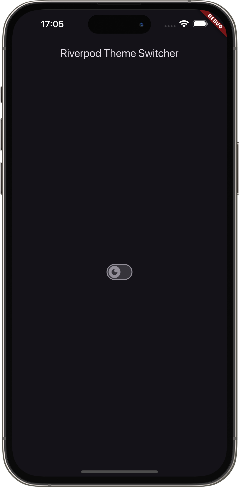
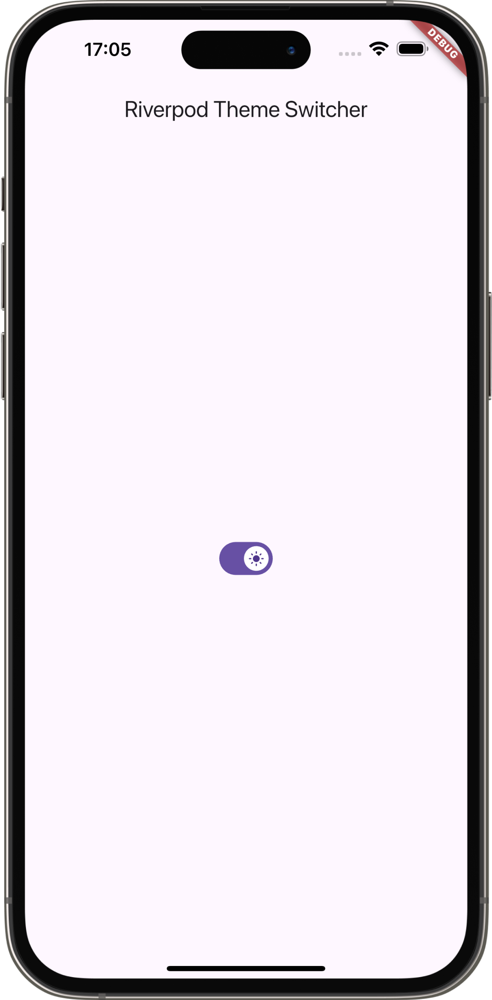

# riverpod_theme_switcher

It's a Flutter app with switcher for light and dark theme.

It works with Riverpod.

Tutorial from [Flutter Mapper](https://www.youtube.com/watch?v=qZ21x_ugJjA)

## Screenshots

  
  

